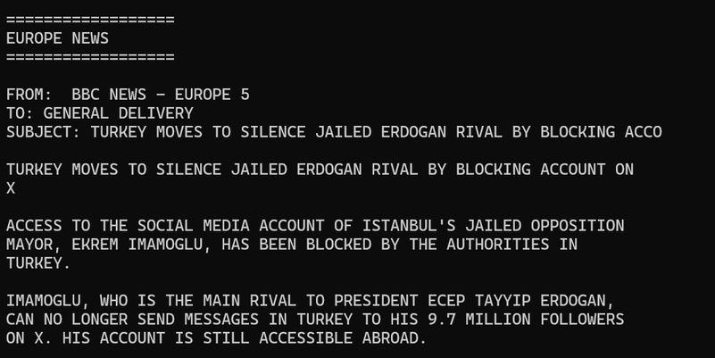
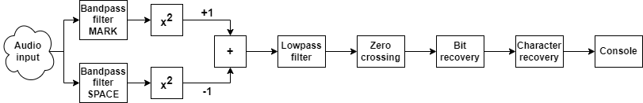

# IttyEurope - Internet Teletype Europe Receiver

[IttyEurope](https://github.com/vurdalakov/itty-europe) is a small experimental program written in C# and .NET 8 that receives and decodes
Europe News RTTY channel of the [Internet Teletype](https://www.rtty.com/itty/index.htm).

* Inspired by [DSP tutorial: RTTY decoder using IIR filters](https://dp.nonoo.hu/projects/ham-dsp-tutorial/18-rtty-decoder-using-iir-filters/index.html)
* Butterworth filters designed by [Tony Fisher's mkfilter](https://web.archive.org/web/20200830000623/https://www-users.cs.york.ac.uk/~fisher/mkfilter/)
* Uses [NAudio library](https://github.com/naudio/NAudio) to receive audio channel

### Block diagram

### RTTY parameters

* MARK tone: `1275` Hz
* SPACE tone: `1445` Hz
* Baud: `50`
* URL: http://internet-tty.net:8040/EUROPE

### License

The contents of this repository are made available under the terms of the [MIT license](https://opensource.org/licenses/MIT).
